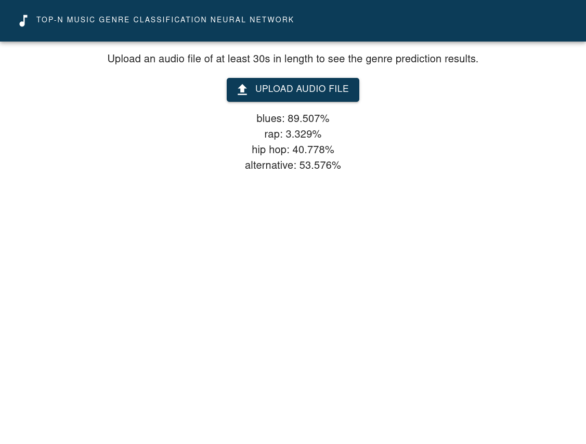

# Usage

Simply upload an audio file to our web application with the click of a button
and our trained neural network will return a genre classification for your
song.



# Installation

This repository contains the code for the entire Top N Music Genre Classifier
project. Simply put, the code for the web front end is a react app which lives
in the `frontend` directory and the code for each of our microservices lives in
the `services` directory. Those services are all independent python projects
but depend on each other to some extent. The services directory contains the
following:

- etl-service
- install-services.sh
- neural-network
- prediction-api
- utilities

The shell script `install-services.sh` is used to install all of the
dependencies for each of the services (i.e. `etl-service`, `neural-network`,
`prediction-api`, and `utilities`) and additionally run database migrations for
our common sqlite database. You will need to have
[poetry](https://python-poetry.org/) installed before running
`install-services.sh` as it is used for each service to manage dependencies.
Please see the following sections for how to run each service.


## Frontend

Assuming you have the node package manager (`npm`) installed, the web
application can be started by issuing the following commands.

```bash
cd frontend
npm install
npm run start
```

**Note:** the front end makes network calls to our back end prediction API
service. This service will have to be running for the front end to function
correctly. [See the prediction-api for instructions](#prediction-api)

## prediction-api

This service provides an interface between the web frontend and the neural
network model. It has an endpoint for a `POST` request at `/api/predict-genres/
which accepts an audio file input as input and return the genre
classifications. Behind the scenes it calls the other services to process the
audio file into an image and predict the genre using the trained model. To start
this application:

```bash
cd services/prediction-api
python prediction_api/main.py
```

## etl-service

At the current state of our project, this service watches a directory
`$HOME/gtzan`, by default, and processes all files with extension `.wav` and
converts them into images in memory. After each file is processed it it moved
into the directory `$HOME/gtzan/processed`, by default, the converted image is
stored into our database along with its corresponding genre. Of course, this
requires that you have the [gtzan](https://arxiv.org/abs/1306.1461) dataset
located in your home directory by the name of `gtzan`.

To run this service:

```bash
cd services/etl-service
python etl_service/main.py
```

This service will continue to run until you kill the process. Also note that
you will need to have already run the database migrations which are defined in
the script `install-services.sh` as this services writes to the database.

## neural-network

TODO: this service is a work in progress. It reads the data out of the
database, trains the neural network, and saves the model to disk to be loaded
by the prediction API.


## utilities

This service contains shared program logic. Currently we have two services
included as utilities. Those are `audio_processor`, to process the audio files
into images, and `db` which manages our database. These services do not have to
be run independently as they are imported by the other services. Just make sure
that the database migrations have been completed as described above. This can
also be manually run as follows:

```bash
cd services/utilities
poetry run alembic upgrade head
```
